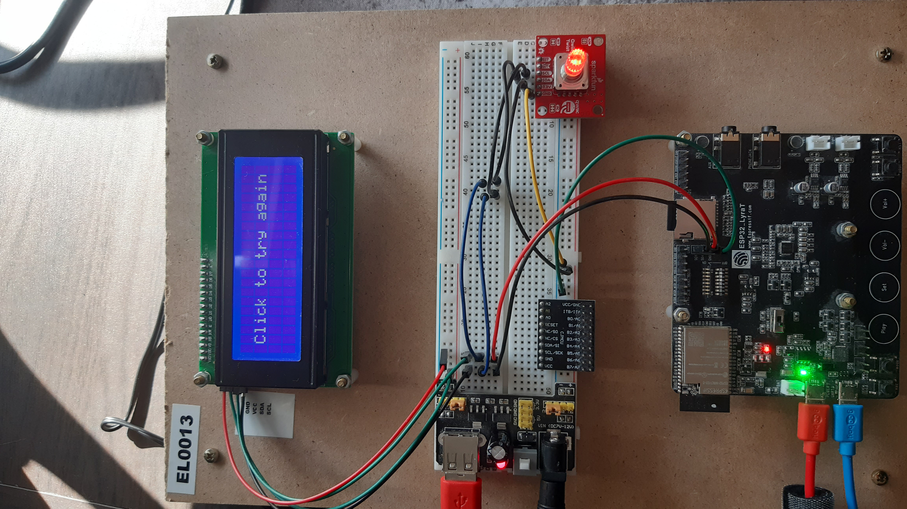

# IMC-Individueel Menno Bil

## Hoi reviewer,
Nice dat je mijn project mag reviewen. Ik hoop dat de code niet 
één groot spaghetti bord is en je er daadwerkelijk een beetje doorheen komt :D.
Om het project te runnen heb je nodig:
- Een esp32 lyra-t bord (proftaak)
- Een lcd scherm (proftaak)
- Een rotary encoder
- En een paar handen om alles te besturen natuurlijk

---

Hierbij een foto van de opstelling hoe alle draadjes verbonden moeten worden:

---

Voor deze eindopdracht heb ik een hele kleine en simpele game engine gebouwd voor de lcd zodat je bijvoorbeeld simpele games
zoals de google dino game of flappy bird zou kunnen maken en spelen. Al mijn eigen geschreven code bevind zich
in de "esp32-game" component en bevat code over het renderen van text (half in beeld renderen), het laten zien van verschillende
scenes, code van de camera, wat code over collision detection tussen verschillende game objecten en nog een paar andere dingen.

Als kleine demo van de engine heb ik zelf een mini-game gemaakt waarmee je een player hebt die word gevolgd door de camera
en die kan rond springen over een aantal platformen. Daarnaast als je van het platform afvalt word je teruggestuurd naar
het "Try again" scherm en daar kan je op klikken om opnieuw te beginnen (je kan ook op het try again scherm komen door de rotary
encoder ingedrukt te houden). Hieronder de link naar het filmpje van de demo:

https://www.youtube.com/watch?v=k2QjWd4fGxc
